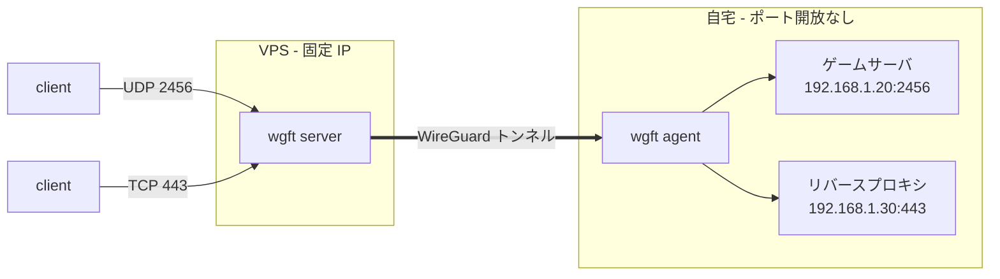
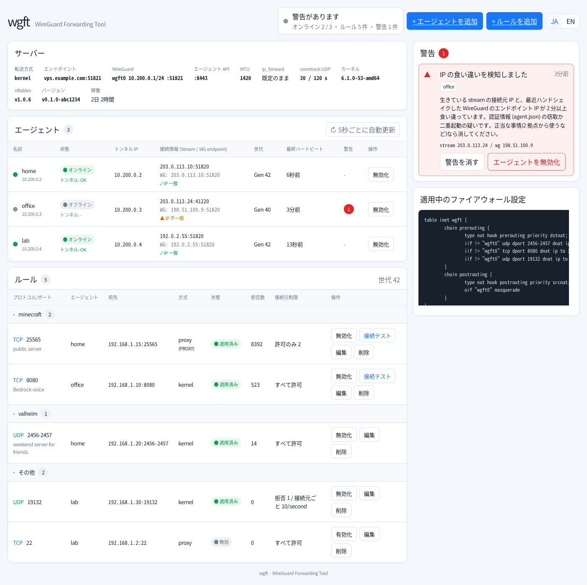

# wgft - WireGuard Forwarding Tool

[](LICENSE)
[](.github/workflows/ci.yml)
[](#開発状況)

[English](README.md) | 日本語

wgft は、VPS に届いた TCP/UDP 通信を WireGuard 経由で自宅ネットワーク上のサービスへ転送するツールです。自宅側の agent から VPS へ接続するため、自宅ルータのポート開放は不要で、CGNAT や二重 NAT の環境でも使えます。



wgft は、任意の TCP/UDP ポートをそのまま転送したい用途、特にゲームサーバの公開を主な用途にしています。HTTPS も転送できますが、TLS 終端や認証は行わず、自宅側のリバースプロキシに任せます。

## 開発の背景

wgft は Pangolin から着想を得ています。Pangolin を使ったことで、VPS を入口にして自宅ネットワーク上のサービスを公開する構成の便利さを知りました。

作者の主な用途は、ゲームサーバなどの任意 TCP/UDP ポート転送です。日本で使われている IPv4 over IPv6 接続の一部では、グローバル IPv4 アドレスを共有したり、利用できる受信ポートが制限されたりするため、自宅側で任意の IPv4 ポートを外部公開できない場合があります。VPS を入口にして WireGuard で自宅へ転送すればこの制約を避けられますが、WireGuard と NAT / firewall のルールを手作業で維持するのは煩雑です。

wgft は Pangolin の代替を目指すものではなく、この構成のうち自分に必要だった L4 の TCP/UDP 転送と、そのための WireGuard / nftables の設定管理に役割を絞っています。

## 特徴

- 1 つのバイナリに VPS 側 server、自宅側 agent、CLI を収録
- カーネルモードでは Linux の WireGuard と nftables DNAT を使うため、wgft プロセスを再起動しても既存の転送は継続
- ユーザー空間モードは root 不要で、コンテナ内だけでも動作
- TCP/UDP の単一ポート・ポート範囲を転送
- ルールごとの allow/deny とレート制限
- ルール変更時も無関係なセッションは切断しない
- TCP ルールでは PROXY protocol v2 により実クライアント IP を転送可能
- agent、ルール、警告、転送状態を確認できる Web ダッシュボード
- `wgft server teardown` は wgft が作成した状態だけを削除

wgft は意図的に機能を絞っています。ポート転送に専念し、TLS、SSO、証明書、Web アプリ公開機能は他のソフトウェアに任せます。

## 動作モード

| | カーネルモード `kernel` | ユーザー空間モード `userspace` |
|---|---|---|
| VPS の root 権限 | 必要 | 不要 |
| カーネル / nftables | Linux 6.1+、nftables 1.0.6+ | 不要 |
| 転送経路 | カーネル WireGuard + nftables DNAT | wireguard-go + ユーザー空間 netstack |
| `wgft server` 停止時 | 既存の転送は継続 | 転送も停止 |
| レート制限の判定場所 | カーネル | wgft プロセス |

VPS で root が使える場合はカーネルモードを使います。root やカーネル WireGuard が使えない場合、または server をコンテナ内だけで動かしたい場合はユーザー空間モードを使います。

VPS 側も自宅側も現在は Linux / IPv4 のみ対応しています。自宅側 agent には root 権限も TUN デバイスも不要です。

## クイックスタート

ここでは最も一般的な構成として、Linux VPS 上のカーネルモードと、自宅側の通常バイナリ agent を使います。ユーザー空間モード、Docker、systemd の詳細、firewall、HTTPS、削除方法は [セットアップガイド](docs/setup.ja.md) を参照してください。

### 1. wgft を入手する

VPS と自宅マシンの両方で release バイナリを取得します。

```sh
curl -LO https://github.com/rahanahu/wgft/releases/latest/download/wgft-linux-amd64
chmod +x wgft-linux-amd64
```

arm64 環境では `amd64` を `arm64` に置き換えてください。

### 2. VPS 側 server を起動する

```sh
sudo install -m 0755 wgft-linux-amd64 /usr/local/bin/wgft
sudo mkdir -p /etc/wgft
printf 'WGFT_MODE=kernel\nWGFT_WG_ENDPOINT=vps.example.com:51820\n' | sudo tee /etc/wgft/server.env
sudo chmod 0600 /etc/wgft/server.env
sudo wgft server check
sudo wgft server run
```

VPS の firewall で UDP 51820 と TCP 8443 を開けてください。`wgft server check` は、既存 firewall に追加で必要な forwarding 許可も表示します。

カーネルモードでは IPv4 forwarding が必要です。wgft は必要に応じて `net.ipv4.ip_forward=1` を設定し、`wgft server teardown` は元に戻す方法を表示します。

別の VPS shell で、一度だけ使える join string を発行します。

```sh
sudo wgft agent join-string --name home
```

### 3. 自宅側 agent を起動する

```sh
mkdir -p ~/.local/bin ~/.wgft
mv wgft-linux-amd64 ~/.local/bin/wgft
WGFT_JOIN='<join string>' ~/.local/bin/wgft agent run --data-dir ~/.wgft
```

認証情報は `~/.wgft/agent.json` に保存されます。join string が必要なのは初回登録時だけです。

### 4. 転送ルールを追加する

VPS 側で実行します。

```sh
sudo wgft agent ls
sudo wgft rule add --agent home --udp 2456-2457 --to 192.168.1.20:2456 --group game
```

ポート範囲を指定した場合、`--to` は転送先の先頭ポートを示します。この例では VPS の UDP 2456 は `192.168.1.20:2456` へ、UDP 2457 は `192.168.1.20:2457` へ転送されます。

転送対象のポートも VPS の firewall で開けてください。ルールが有効になると、VPS に届いた通信が WireGuard トンネルを通って自宅側の転送先へ届きます。

## Web UI



ダッシュボードでは agent の接続状態、ルール、drop カウンタ、警告、適用中の nftables 状態を確認できます。join string の発行や通常のルール操作も行えます。

管理 API は既定では外部公開されず、`/run/wgft/admin.sock` でのみ待ち受けます。SSH で手元へ転送します。

```sh
ssh -L 8686:/run/wgft/admin.sock root@vps
```

その状態で `http://localhost:8686` を開きます。その他の管理画面への接続方法は [セットアップガイド](docs/setup.ja.md#web-ui) を参照してください。

## ドキュメント

- [セットアップガイド](docs/setup.ja.md) - カーネル / ユーザー空間モード、root なし運用、Docker、systemd、HTTPS、Web UI、削除方法
- [CLI リファレンス](docs/cli.md) - 各コマンドと使用例
- [設計](docs/design.md) - プロトコル、セキュリティ、転送動作、設計判断
- [アーキテクチャ](docs/architecture.md) - package 構成と処理経路
- [CLAUDE.md](CLAUDE.md) - 開発上のルール、テスト環境

`wgft <command> --help` でも各コマンドの使用例を確認できます。

## 開発状況

Alpha、v0.2.0。カーネルモードは作者の VPS / 自宅環境で UDP/TCP 転送、NAT 越え、再接続、VPS 再起動からの復旧、teardown を確認済みです。ユーザー空間モードは開発環境で確認済みです。実装や構成の詳細は設計・セットアップ文書を参照してください。

## セキュリティ

付属の server 用 systemd unit では、wgft は転送に必要な capability だけを持つ非特権ユーザーとして動作します。外部へ公開されるのは WireGuard、agent API、明示的に転送したポートだけで、管理 API は既定ではローカル専用です。

脆弱性の報告方法は [SECURITY.md](SECURITY.md) を参照してください。

## ライセンス

[MIT](LICENSE)。バイナリに含まれる Go module のライセンスは `THIRD_PARTY_LICENSES.txt` にまとめ、release と container image にも含めています。
