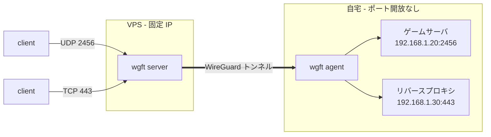

# wgft - WireGuard Forwarding Tool

[](LICENSE)
[](.github/workflows/ci.yml)
[](#開発状況)

[English](README.md) | 日本語

wgft は、VPS に届いた通信を WireGuard のトンネル経由で自宅のサービスへ転送するツールです。自宅側のエージェントが VPS へ接続するため、自宅のルータでポートを開ける必要がなく、ポートを開けられない回線でも使えます。

VPS は通信の内容を読まずにそのまま転送するため、UDP のゲームサーバも HTTPS のサイトも同じ 1 行のルールで公開できます。証明書と認証は自宅側のリバースプロキシが担当します。



## 想定する使い方

wgft は、UDP のゲームサーバやボイスチャットのように、UDP を確実に通したい用途に向いています。転送するのがゲームサーバだけであれば、自宅側に必要なのはエージェント 1 つです。

HTTPS を公開する場合は、TLS の終端と証明書の管理を自宅側のリバースプロキシで行います。wgft は 443 番ポートの通信をそのまま自宅へ転送するだけで、証明書や認証の機能を持ちません。Pangolin や Cloudflare Tunnel との違いは「他のツールとの違い」にまとめました。

## 他のツールとの違い

wgft、[Pangolin](https://github.com/fosrl/pangolin)、Cloudflare Tunnel は、いずれも自宅のサービスを VPS や外部のネットワーク経由で公開するツールです。Pangolin は、自己ホスト型の統合されたリバースプロキシです。証明書の自動取得、SSO を含む ID 連携によるアクセス制御、PIN やパスコードで保護した限定公開リンク、Web ダッシュボードを備えます。Cloudflare Tunnel は、自宅側で動かすコネクタを Cloudflare のネットワークへつなぎ、HTTPS のアプリケーションを公開する用途を中心にしたサービスです。

wgft が優れている点:
- 軽量な常駐: VPS 側は静的バイナリと systemd のユニットだけで動きます。Docker も Traefik も要らず、常駐メモリは十数 MB です
- カーネルによる転送: nftables の DNAT とカーネル内蔵の WireGuard が処理するため、UDP のゲームや任意の TCP がそのまま通ります。wgft のプロセスを再起動しても、既存のフローは切断されません
- 既存設定への非干渉: 他の WireGuard インタフェースや nftables のテーブルには触れません。`wgft server teardown` で VPS を元の状態に戻せます
- 最小限の設定: 1 つの env ファイルにモードと接続先を書き、ルールを追加するだけで動きます。ドメインも証明書も要りません

wgft が劣っている点:
- HTTPS を扱わない: 証明書、SSO、限定公開リンクによる共有、ブラウザで完結する認証は、自宅側のリバースプロキシに任せます
- 限られた到達経路: 管理画面には root の Unix ソケット、SSH のポート転送、Tailscale のいずれかでしか到達できません。複数ユーザーの権限管理もありません
- 単純な管理単位: サイトやユーザーという単位の管理機能はなく、エージェントとルールだけを扱います

認証と証明書の管理をまとめて任せて Web サービスを公開したいなら、Pangolin を選びます。ゲームサーバや任意のポートを、動く部品をできるだけ減らして公開したいなら、wgft を選びます。

## できること

- 2 つの動作モード: VPS で root が使えるならカーネルモード、使えないならユーザー空間モードを選べます。違いは[動作モード](#動作モード)の節にまとめてあります
- カーネルによる転送: カーネルモードでは、nftables の DNAT でトンネルへ転送するため、VPS 上でパケットをコピーするプロセスがありません。wgft は自分のテーブルを 1 つだけ持ち、既存の nftables の設定には触れません
- 接続元の制限: ルールごとに拒否リスト、許可リスト、レート制限 (新規フロー、パケット、接続元ごと) を設定できます。拒否リストへの追加は、通信中のフローも即座に切断します
- 設定変更中のセッションの維持: ルールの追加、削除、ポート範囲の変更を行っても、無関係なセッションは切断されません
- 接続元 IP の受け渡し: TCP ルールをプロキシモードにすると PROXY protocol v2 のヘッダが付くため、対応するリバースプロキシは接続元 IP を受け取れます
- 認証情報の不正使用の警告: 自宅側の認証情報 (`agent.json`) が別の場所からも使われると、接続元 IP の食い違いか往復として警告を表示します
- アンインストール: `wgft server teardown` は wgft が作成したものだけを削除し、手動で戻す項目を一覧で表示します

## Web UI


ダッシュボードは、エージェントの接続状態、ルールの適用状態と拒否数、警告、適用中の nftables の設定を 1 画面に表示します。エージェントとルールの追加、TCP ルールの接続テストもこの画面から実行できます。表示は日本語と英語を切り替えられます。

ログイン画面はありません。管理 API は VPS の TCP ポートでは待ち受けず、root だけが開ける Unix ソケット `/run/wgft/admin.sock` だけで待ち受けます。手元のブラウザからは、SSH で手元のポートをそのソケットへ転送して開きます。`ssh -L` の転送先にはポートだけでなくソケットのパスも書けます。ソケットは root 所有なので、root でログインします。

```sh
ssh -L 8686:/run/wgft/admin.sock root@vps
```

接続したまま `http://localhost:8686` を開きます。root で SSH できない場合は、`server.env` に `WGFT_ADMIN=127.0.0.1:8686` を設定すると、ソケットの代わりに VPS のループバックアドレスの TCP 8686 で待ち受けるようになり、`ssh -L 8686:127.0.0.1:8686 vps` で転送できます。この設定では VPS 上の全ユーザーが管理 API に到達できるようになります。Tailscale を使っている場合は、`WGFT_ADMIN_TAILSCALE=true` を設定すると、tailnet の端末から `http://<VPS の Tailscale IP>:8686` で開けます。VPS に `tailscale` コマンドがあれば、MagicDNS の名前を自動で検出し、Host としても受け付けます。`WGFT_ADMIN_HOST` には、それ以外の名前を追加します。

## 動作環境

VPS 側も自宅側も Linux で動きます。対応するのは IPv4 のみです。名前でアクセスさせる場合は、VPS を指すドメインが必要です。自宅側の `wgft agent` に追加の要件はなく、root 権限も TUN デバイスも必要ありません。VPS 側の `wgft server` の要件は、動作モードで決まります。

### 動作モード

`wgft server` には 2 つの動作モードがあります。`WGFT_MODE` で選び、初回の起動時に記録されます。`wgft agent` は、どちらのモードでも同じものを同じ手順で使います。

| | カーネルモード `kernel` | ユーザー空間モード `userspace` |
|---|---|---|
| root 権限 | 必要です | 不要です |
| カーネルと nftables の要件 | カーネル 6.1 以上、nftables 1.0.6 以上 | なし |
| 転送の仕組み | カーネルの WireGuard と nftables の DNAT | wgft のプロセス内の wireguard-go と netstack |
| `wgft server` を止めたとき | WireGuard のインタフェースと nftables のテーブルが残るので、転送は続きます | 転送も止まります |
| 制限を判定する場所 | カーネルです。超過分は wgft のプロセスに届きません | wgft のプロセスです。超過分を捨てる処理にも CPU を使います |

root が使える VPS では、カーネルモードを選びます。ユーザー空間モードは、root が使えない VPS、カーネルに WireGuard のモジュールが無い VPS、コンテナだけで完結させたい場合のためのモードです。

カーネルモードの要件は、カーネルと nftables の版だけです。ディストリビューションは問いません。作者が確認した環境は、要件の下限に当たる Debian 12 と、Ubuntu 26.04 です。WireGuard はカーネルに含まれているものを使うので、パッケージを追加で入れる必要はありません。カーネルに WireGuard のモジュールが無い VPS では、`wgft server` は起動時にその旨を表示して止まります。

ユーザー空間モードでは、`packet` のレート制限は UDP にだけ効きます。設計上の違いの詳細は [docs/design.md](docs/design.md) の 6.3 節にあります。

## セットアップ

**1. バイナリを入手する**

1 つのバイナリが server、agent、CLI を兼ねます。VPS と自宅のそれぞれで、[Releases](https://github.com/rahanahu/wgft/releases) から取得します。arm64 のマシンでは `amd64` を `arm64` に読み替えてください。

```sh
curl -LO https://github.com/rahanahu/wgft/releases/latest/download/wgft-linux-amd64
curl -LO https://github.com/rahanahu/wgft/releases/latest/download/wgft-linux-amd64.sha256
sha256sum -c wgft-linux-amd64.sha256
```

Go 1.26 以上があれば、`go install github.com/rahanahu/wgft/cmd/wgft@latest` でもインストールできます。

**2. VPS に server を配置する**

配置の手順は[動作モード](#動作モード)で分かれます。root が使える VPS ではカーネルモード、使えない VPS やコンテナで動かしたい場合はユーザー空間モードを選びます。どちらの手順も、最後に接続文字列を発行して手順 3 へ進みます。

設定は `WGFT_*` の環境変数で行います。`/etc/wgft/server.env` に書いておくと起動時に読み込まれます。項目の一覧と必須の項目は [deploy/server.env.example](deploy/server.env.example) を参照してください。動作モードと、エージェントが接続する VPS のアドレスを設定すれば起動できます。

*カーネルモードで配置する*

```sh
sudo install -m 0755 wgft-linux-amd64 /usr/local/bin/wgft
sudo mkdir -p /etc/wgft
printf 'WGFT_MODE=kernel\nWGFT_WG_ENDPOINT=vps.example.com:51820\n' | sudo tee /etc/wgft/server.env
sudo chmod 0600 /etc/wgft/server.env
```

起動する前に、環境を検査します。

```sh
sudo wgft server check
```

`check` は次の 3 つを報告します。

- 有効な設定 (動作モード、インタフェース名、WireGuard のポート、アドレス帯) と、前回の起動で記録した値との一致
- 別の名前で残っている、同じサーバ鍵を持つ WireGuard インタフェース (`WGFT_WG_INTERFACE` を変えた後に残ります)
- 既存のファイアウォールに追加が必要な行。forward チェーンが `policy drop` の環境 (ufw や Docker を導入した VPS では既定でこの状態です) では、wgft の転送を通すための行を表示します。この行はポートに依存しないため、一度追加すれば、以後ルールを増やしても追加は不要です

wgft はファイアウォールを自動では変更しません。表示された行は手動で追加してください。wgft が書き換えるカーネルの設定は `net.ipv4.ip_forward=1` だけで、DNAT による転送に必要です。戻し方は `wgft server teardown` が表示します。

続けて、WireGuard の UDP 51820 とエージェント用 API の TCP 8443 をファイアウォールで開けます。ufw の場合は次のとおりです。firewalld の場合は `firewall-cmd --permanent --add-port=51820/udp --add-port=8443/tcp` を実行します。

```sh
sudo ufw allow 51820/udp
sudo ufw allow 8443/tcp
```

常駐させる場合は、[deploy/server.service](deploy/server.service) の unit をそのまま使えます。

```sh
sudo install -m 0644 deploy/server.service /etc/systemd/system/wgft.service
sudo systemctl daemon-reload
sudo systemctl enable --now wgft
```

常駐させずに試す場合は、`sudo wgft server run` でそのまま起動できます。

*ユーザー空間モードで配置する*

ユーザー空間モードには、systemd で動かす、利用者の権限で直接起動する、Docker で動かす、の 3 通りがあります。どの場合も、WireGuard の UDP 51820、エージェント用 API の TCP 8443、転送するポートをファイアウォールで開けます。`wgft server` を再起動すると、トンネルが張り直されるまで転送が止まります。ラボでは 15 秒で戻りました。

systemd で動かす場合は、カーネルモードと同じ手順で、`server.env` の動作モードだけを変えます。unit も同じものを使います。`wgft server check` は nftables を使わない旨を表示します。

```sh
printf 'WGFT_MODE=userspace\nWGFT_WG_ENDPOINT=vps.example.com:51820\n' | sudo tee /etc/wgft/server.env
```

root が使えない VPS では、設定とデータを自分のディレクトリに置き、利用者の権限で起動します。管理 API のソケットも同じディレクトリに置きます。この形では 1024 未満のポートで待ち受けられません。以降のコマンドには、`sudo` の代わりに `--config ~/wgft/server.env` を付けます。

```sh
install -d -m 0700 ~/wgft
printf 'WGFT_MODE=userspace\nWGFT_WG_ENDPOINT=vps.example.com:51820\nWGFT_DATA_DIR=%s/wgft\nWGFT_ADMIN=unix://%s/wgft/admin.sock\n' "$HOME" "$HOME" > ~/wgft/server.env
chmod 0600 ~/wgft/server.env
wgft server run --config ~/wgft/server.env
```

Docker で動かす場合は、イメージに `WGFT_MODE=userspace` が設定済みです。コンテナで動かせるのはユーザー空間モードだけです。compose ファイルを使うためにリポジトリを取得し、[deploy/server.compose.yaml](deploy/server.compose.yaml) の `WGFT_WG_ENDPOINT` を書き換えて起動します。compose ファイルは `ports:` でポートを公開するため、転送するポートはすべてそこに並べます。`network_mode: host` にすると並べずに済みますが、コンテナがホストの制限を引き継ぐため 1024 未満のポートは使えません。`ports:` の形なら 443 も使えます。どちらも手元でビルドしたイメージで確かめました。

```sh
git clone https://github.com/rahanahu/wgft.git && cd wgft
# deploy/server.compose.yaml の次の行を書き換える
#   WGFT_WG_ENDPOINT: "REPLACE_WITH_vps.example.com:51820"  -> この VPS のアドレスと WireGuard のポート
docker compose -f deploy/server.compose.yaml up -d
```

CLI はコンテナの中で実行します。server と同じ `WGFT_ADMIN` を読むため、状態ボリューム内の管理ソケットへ直接届きます。以降のコマンドには、`sudo` の代わりに `docker compose -f deploy/server.compose.yaml exec wgft-server` を付けます。公開イメージ `ghcr.io/rahanahu/wgft-server` は v0.2.0 のリリースから公開します。

*接続文字列を発行する*

最後に、自宅のエージェント用の接続文字列を発行します。

```sh
sudo wgft agent join-string --name home
```

次のような 1 行が出力されます。1 回限りで 1 時間有効で、手順 3 でそのまま使います。期限が切れたら同じコマンドで発行し直します。

```text
wgft://vps.example.com:8443/k3Jt8vQwN2mXbL7cR9aZpQ#sha256:3f1c9a0b7d2e4c8a1f6b5e9d0c3a7b2e8d4f1a6c5b9e0d3f7a2c8b1e6d4f9a02
```

server を起動した後の操作は、コマンドの代わりに [Web UI](#web-ui) でも行えます。接続文字列の発行は、ダッシュボードの「+ エージェントを追加」で名前を入力して生成します。手順 4 のルールの追加は「+ ルールを追加」です。ルールの有効化と無効化、削除、グループとメモの編集、TCP ルールの接続テスト、エージェントの無効化、警告の解除も Web UI から行えます。接続元の拒否と許可の一覧、レート制限、ルールの分割と統合、JSON からの一括置き換えは、コマンドでだけ設定できます。Web UI はそれらの設定値と drop の累計を表示します。

**3. 自宅に agent を配置する**

自宅側の起動方法は、バイナリと Docker のどちらか一方を選びます。どちらも root 権限は必要ありません。

*バイナリで起動する*

取得したバイナリを PATH の通った場所に置き (下のコマンドは `~/.local/bin` を使います。PATH に無ければ追加してください)、手順 2 で発行した接続文字列を渡して起動します。接続文字列は `wgft://` で始まる出力をそのまま貼ります。`#` が含まれるため、シェルではシングルクォートで囲みます。`--data-dir` には、認証情報 (鍵と登録情報) を保存するディレクトリを指定します。

```sh
chmod +x wgft-linux-amd64 && mkdir -p ~/.local/bin ~/.wgft && mv wgft-linux-amd64 ~/.local/bin/wgft
WGFT_JOIN='<手順 2 で発行した接続文字列>' wgft agent run --data-dir ~/.wgft
```

初回の起動で登録が完了し、認証情報が `~/.wgft/agent.json` に保存されます。2 回目以降は接続文字列なしで `wgft agent run --data-dir ~/.wgft` だけで起動できます。

常駐させる場合は、[deploy/agent.service](deploy/agent.service) の unit を使えます。権限を持たない専用ユーザー `wgft` で動き、バイナリは `/usr/local/bin/wgft` を、設定は `/etc/wgft/agent.env` を読みます。設定に要るのは接続文字列だけです。

```sh
sudo install -m 0755 ~/.local/bin/wgft /usr/local/bin/wgft
sudo useradd --system --home-dir /var/lib/wgft --shell /usr/sbin/nologin wgft
sudo mkdir -p /etc/wgft
printf 'WGFT_JOIN=<手順 2 で発行した接続文字列>\n' | sudo tee /etc/wgft/agent.env >/dev/null
sudo chown root:wgft /etc/wgft/agent.env && sudo chmod 0640 /etc/wgft/agent.env
sudo install -m 0644 deploy/agent.service /etc/systemd/system/wgft-agent.service
sudo systemctl daemon-reload && sudo systemctl enable --now wgft-agent
```

認証情報は `/var/lib/wgft/agent.json` に保存されます。

*Docker で起動する*

バイナリは不要です。エージェントのイメージは `ghcr.io/rahanahu/wgft-agent` として amd64 と arm64 向けに公開しています。compose ファイルを使うためにリポジトリを取得し、[deploy/agent.compose.yaml](deploy/agent.compose.yaml) の 1 行を書き換えて起動します。イメージをリポジトリからビルドする場合は、compose ファイルの `build:` の行のコメントを外し、コマンドに `--build` を付けます。コンテナから LAN 内の転送先に届かない環境では、compose ファイルの `network_mode: host` のコメントを外します。

```sh
git clone https://github.com/rahanahu/wgft.git && cd wgft
# deploy/agent.compose.yaml の次の行を書き換える
#   WGFT_JOIN: "REPLACE_WITH_JOIN_STRING"  -> 手順 2 で発行した接続文字列をそのまま
# WGFT_NAME は不要です。エージェントの名前は接続文字列に紐付いています。行は削除するか空のままにします
docker compose -f deploy/agent.compose.yaml up -d
```

**4. 転送ルールを追加する**

VPS で `agent ls` を実行し、エージェントが登録されたことを確認します。

```sh
sudo wgft agent ls
```

`home` の行で、STREAM にエージェントの IP、TUNNEL に `ok`、HANDSHAKE に経過時間が入っていれば登録は完了しています。RULES はまだ空です。

```text
NAME  ADDRESS     STREAM              HEARTBEAT  GEN  TUNNEL  WG_ENDPOINT         HANDSHAKE  RULES  WARN
home  10.200.0.2  203.0.113.10:39222  4s ago     1    ok      203.0.113.10:51820  12s ago
```

ルールを追加します。

```sh
# ゲームサーバ: VPS の UDP 2456-2457 を、自宅の 192.168.1.20:2456 へ
sudo wgft rule add --agent home --udp 2456-2457 --to 192.168.1.20:2456 --group game

# HTTPS: VPS の TCP 443 を自宅のリバースプロキシへ。PROXY protocol で接続元 IP も渡す
sudo wgft rule add --agent home --tcp 443 --to 192.168.1.30:443 --proxy --proxy-protocol
```

ポートが範囲のときは、`--to` に先頭のポートを書きます。以降のポートは連番で写り、この例では 2457 が 192.168.1.20:2457 に届きます。転送するポート (この例では UDP 2456-2457 と TCP 443) をファイアウォールで開け、`sudo wgft agent ls` の RULES 列が `ok` になれば完了です。ルールは数秒で自宅側に届き、追加や削除を行っても進行中のセッションは切断されません。不正な接続元があれば、`sudo wgft rule deny add <ルール ID> 203.0.113.0/24` で、通信中のフローを含めて遮断できます。ルール ID は、`rule ls` が表示する先頭部分だけで指定できます。

**HTTPS を出すには**

TLS の終端と証明書は自宅側のリバースプロキシで行い、wgft は 443 番と 80 番を転送するだけです。Caddy を使う場合の構成をラボで確認しました (`lab/caddy/` に設定と記録があります)。

Caddy は 2.11 以降が必要です。Debian 12 の apt パッケージ (2.6.2) には PROXY protocol の listener wrapper が入っていないため、Caddy 公式の apt リポジトリから入れます。Caddy をエージェントと同じホストで動かし、次の 2 本のルールを追加します。443 番はプロキシモードにして PROXY protocol で接続元 IP を渡し、80 番は素通しにします。

```sh
sudo wgft rule add --agent home --tcp 443 --to 192.168.1.30:443 --proxy --proxy-protocol
sudo wgft rule add --agent home --tcp 80  --to 192.168.1.30:80
```

Caddyfile では、443 番の listener にだけ `proxy_protocol` を掛け、`allow` にはエージェントが動くホストのアドレスを書きます。Caddy から見た TCP の接続元はエージェント (中継の最後の接続) であり、VPS の WireGuard アドレスではありません。

```
{
	servers 192.168.1.30:443 {
		listener_wrappers {
			proxy_protocol {
				allow 192.168.1.30/32
			}
			tls
		}
	}
}

example.com {
	reverse_proxy 192.168.1.40:8080
}
```

この構成で、Caddy のアクセスログの `client_ip` は接続元の実 IP になり、Caddy の既定の HTTP から HTTPS へのリダイレクトも動きます (ラボで確認済み)。Let's Encrypt による証明書の取得は、VPS の 80 番が Caddy に届くため動く見込みですが、ラボでは確認できないため未確認です。Caddy の公式ドキュメントに従ってください。

**5. 撤去する**

teardown は wgft が作成したものだけを削除します。他のテーブルやファイアウォールのポートには触れず、手動で戻す項目を一覧で表示します。

```sh
sudo systemctl disable --now wgft
sudo wgft server teardown --dry-run      # 削除するものと、手動で戻す項目を確認する
sudo wgft server teardown --purge --yes  # 実行する。--purge を付けると鍵と証明書も削除する
```

`--purge` を付けなければ鍵と証明書が残るため、server を起動し直せば同じ鍵で復旧し、agent は再接続するだけで済みます。`--purge` で消した後に server を起動し直すと、鍵と証明書が新しくなるため、登録済みの agent は再接続できず、証明書の不一致で接続を試み続けます。そのときは新しい接続文字列を発行し、`WGFT_JOIN` に設定して agent を起動し直します。agent は証明書が変わったことを検出して登録をやり直し、認証情報の `agent.json` と WireGuard の鍵はそのまま使い続けます。ルールは server 側で消えているので、追加し直します。自宅側を丸ごと消すなら `docker compose -f deploy/agent.compose.yaml down -v` で、認証情報を含めて削除できます。

## コマンド一覧

server と agent は同じバイナリです。各コマンドの説明と使用例は `wgft <コマンド> --help` で表示でき、同じ内容を 1 ページにまとめたものが [docs/cli.md](docs/cli.md) にあります。ヘルプと docs/cli.md は英語です。`wgft version` はどちらの側でも版数を表示します。

### server 側で実行するコマンド

VPS 上で実行します。agent とルールを管理するコマンドは、稼働中の server の管理 API を呼び出すので、root として実行します。コンテナで動かしている場合と、利用者の権限で直接起動している場合は、手順 2 にあるとおり `sudo` の代わりの指定を付けます。

| コマンド | 内容 |
|---|---|
| `wgft server run` | server を起動します。systemd の unit とコンテナイメージはこのコマンドを実行します |
| `wgft server check` | 設定と環境を検査します。起動も変更もしません |
| `wgft server nft` | server が適用している nftables のテーブルを表示します |
| `wgft server teardown` | 停止した server が作ったものを撤去します。`--purge` を付けると鍵、ルール、agent の登録も削除します |
| `wgft agent join-string` | 新しい agent 用に、1 回だけ使える接続文字列を発行します |
| `wgft agent ls` | agent の一覧と、stream とトンネルの状態を表示します |
| `wgft agent revoke` | agent を無効化し、トンネルのアドレスを回収します |
| `wgft agent warnings` | 認証情報の盗用が疑われる警告を一覧します |
| `wgft agent dismiss-warning` | 正当な変化だと確認できた警告を消します |
| `wgft rule add` | TCP か UDP のポート、またはポート範囲の転送ルールを追加します |
| `wgft rule ls` | ルールの一覧を、制限の設定と drop の累計とともに表示します |
| `wgft rule rm` | ルールを削除します |
| `wgft rule enable`<br>`wgft rule disable` | ルールを削除せずに有効化、無効化します |
| `wgft rule set` | ルールのグループとメモを変更します |
| `wgft rule deny add`<br>`wgft rule deny rm` | ルールが拒否する接続元の一覧を編集します。通信中のセッションも即座に切れます |
| `wgft rule allow add`<br>`wgft rule allow rm` | ルールが許可する接続元の一覧を編集します。一覧が空の間は、すべての接続元を許可します |
| `wgft rule rate per-source`<br>`wgft rule rate new-flow`<br>`wgft rule rate packet` | レート制限を設定または解除します。値は `10/second` のように書き、解除は `none` です |
| `wgft rule split`<br>`wgft rule merge` | ポート範囲のルールを 2 つに分割、または隣り合う 2 つを統合します。セッションは切れません |
| `wgft rule import` | ルール全体を JSON ファイルの内容で置き換えます |

### agent 側で実行するコマンド

自宅側で、agent を動かしている利用者として実行します。

| コマンド | 内容 |
|---|---|
| `wgft agent run` | agent を起動します。初回の起動では `WGFT_JOIN` で登録します |
| `wgft agent pubkey` | agent の WireGuard の公開鍵を表示します |
| `wgft agent rotate-key` | agent の WireGuard の鍵を作り直します |

## 開発状況

現在はアルファ版の v0.2.0 です。作者の実機ではカーネルモードで、外部からの UDP と TCP の到達、NAT 越しの登録、再登録からの復帰、VPS の再起動からの自動復旧、撤去を確認しました。再起動時の停止は 30 秒未満でした。経路 MTU が 1460 の自宅回線でも、トンネルの MTU は既定の 1420 のままで動きます。外側のパケットは途中で分割されますが、損失はありませんでした。ユーザー空間モードと server のコンテナ、非特権で動く systemd の unit は、開発用のラボでだけ確認しています。実際の Tailscale 経由での Web UI の表示は未確認です。agent は Windows と macOS 向けにもビルドできますが、実機で動かしていないため、Releases には含めていません。

## ドキュメント

- [docs/cli.md](docs/cli.md) - コマンドのリファレンスです。各コマンドのヘルプから生成しています。英語です
- [docs/design.md](docs/design.md) - 設計書です。設計の判断とその理由を記載しています
- [docs/architecture.md](docs/architecture.md) - パッケージの構成と、1 つの操作が通る経路を記載しています
- [CLAUDE.md](CLAUDE.md) - 開発の約束です。ラボの立て方、テストの分け方、CI の検査、文書の書き方を記載しています

## セキュリティ

VPS 側の導入には root 権限が必要です。ただし、同梱の systemd の unit では、プロセス自体は systemd が割り当てる非特権の利用者で動き、持つ権限は `CAP_NET_ADMIN` と `CAP_NET_BIND_SERVICE` だけです。公開 IP で待ち受けるのは、WireGuard、エージェント用 API、転送対象のポートの 3 つだけです。管理 API は公開しません。脆弱性の報告は [SECURITY.md](SECURITY.md) を参照してください。

## ライセンス

[MIT](LICENSE) です。バイナリに含まれる Go モジュールのライセンスは `THIRD_PARTY_LICENSES.txt` にまとめ、各リリースに添付し、コンテナイメージの `/usr/share/doc/wgft/` にも入れています。
