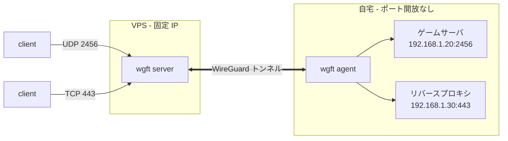
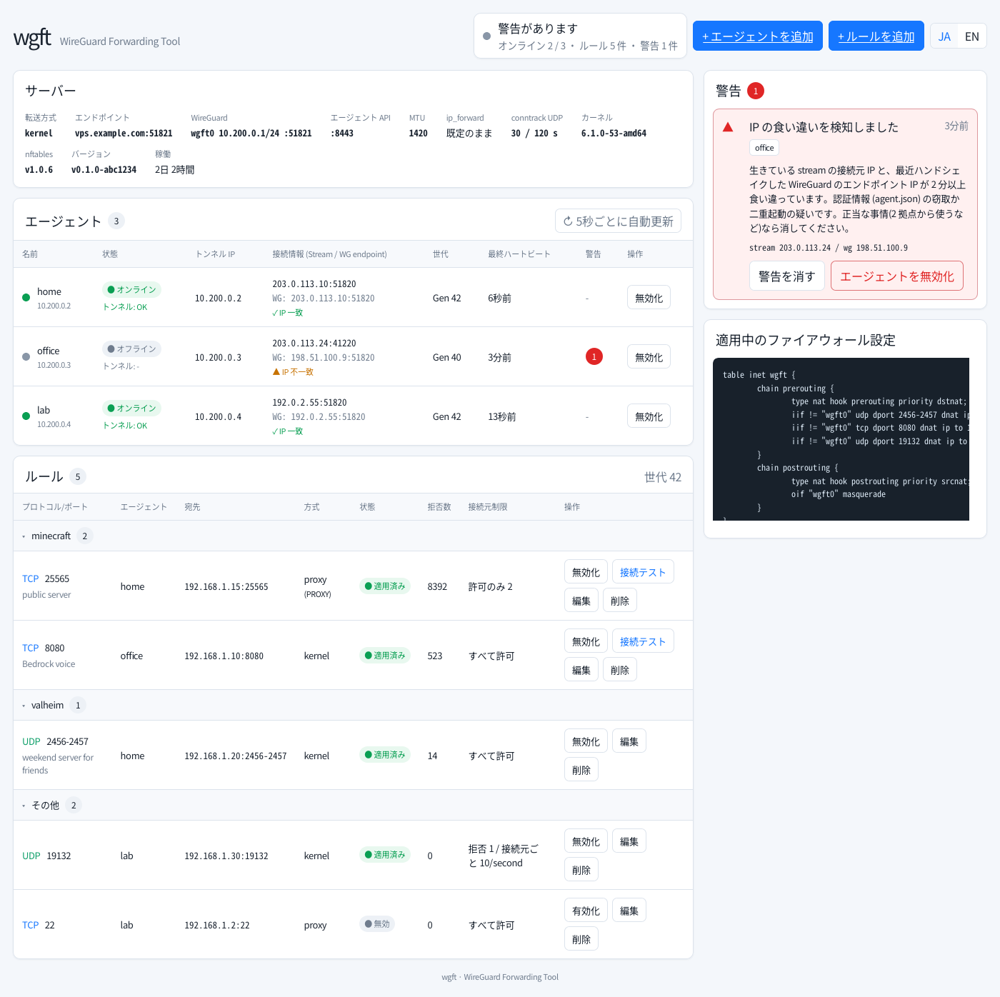

# wgft - WireGuard Forwarding Tool

[](LICENSE)
[](.github/workflows/ci.yml)

[English](README.md) | 日本語

wgft は、VPS に届いた TCP/UDP 通信を WireGuard 経由で自宅ネットワーク上のサービスへ転送するツールです。自宅側の agent から VPS へ接続するため、自宅ルータのポート開放は不要で、CGNAT や二重 NAT の環境でも使えます。


```mermaid
flowchart LR
  c1[client] -->|UDP 2456| s
  c2[client] -->|TCP 443| s
  subgraph vps[VPS - 固定 IP]
    s[wgft server]
  end
  s <==>|WireGuard トンネル| a
  subgraph home[自宅 - ポート開放なし]
    a[wgft agent] --> g[ゲームサーバ<br>192.168.1.20:2456]
    a --> p[リバースプロキシ<br>192.168.1.30:443]
  end
```

wgft は、任意の TCP/UDP ポートをそのまま転送したい用途、特にゲームサーバの公開を主な用途にしています。HTTPS も転送できますが、TLS 終端や認証は行わず、自宅側のリバースプロキシに任せます。

## 特徴

- 1 つのバイナリに VPS 側 server、自宅側 agent、CLI を収録しています。
- VPS のポートを、自宅の TCP/UDP サービスへ転送します。単一ポートとポート範囲を指定できます。
- ルールごとに接続元の allow/deny リストとレート制限を設定できます。
- ルールを変えても、無関係なセッションは切断しません。
- TCP では PROXY protocol v2 により、実際のクライアント IP を転送できます。
- Web UI と CLI で、agent やルールの状態、通信が止まった箇所を確認できます。

## wgft を作った理由

wgft は Pangolin から着想を得ています。Pangolin を使って、VPS を入口に自宅ネットワークへトンネルする構成の便利さを知りました。一方、ゲームサーバなどの raw TCP/UDP 転送だけが目的なら、もっと小さく、ポート転送に特化したツールが欲しいと感じたのが wgft を作ったきっかけです。日本の IPv4 over IPv6 回線など、自宅側で任意の IPv4 ポートを外部公開できない環境も想定しています。

そのため wgft は、WireGuard によるトンネル、nftables によるカーネル転送、シンプルな TCP/UDP ルールに機能を絞っています。必要な WireGuard と wgft 用 nftables ルールは wgft が管理するため、手作業でトンネルや DNAT ルールを組む必要はありません。TLS 終端、SSO、証明書管理、Web アプリ公開は扱わず、リバースプロキシなど別のソフトウェアに任せます。

## 動作環境とモード

VPS 側の server は Linux、agent は Linux、Windows amd64、Apple シリコンの macOS で動作します。Intel Mac には対応していません。転送は IPv4 のみです。server と Linux の agent には、次の 2 つの動作モードがあります。

| | カーネルモード `kernel` | ユーザー空間モード `userspace` |
|---|---|---|
| 転送経路 | Linux の WireGuard と nftables | wireguard-go とユーザー空間 netstack |
| 権限 | `CAP_NET_ADMIN` が必要 | 通常は root 権限と TUN デバイスが不要 |
| wgft プロセス停止中 | 設定済みの転送は継続 | 転送も停止 |

VPS で root が使える場合は、カーネルモードを使います。root やカーネル WireGuard が使えない場合、またはコンテナ内だけで動かす場合はユーザー空間モードを使います。カーネルモードには Linux 6.1 以降と nftables 1.0.6 以降が必要です。agent はユーザー空間モードが既定です。Linux の agent をカーネルモードで動かす条件と手順は [カーネルモードのエージェント](docs/agent-kernel.ja.md)にあります。

Linux のユーザー空間モードでは、ホストのソケットのバッファの設定が必要になる場合があります。また、既定のフロー数の上限では、agent が 1 つ、TCP の転送ポートが 1 つの server に約 5.9 GiB のホストメモリが必要です。この値は設計文書に記載した最悪値の見積もりで、計算に数えたフローの状態やバッファなどが、攻撃によってそれぞれの上限まで同時に埋まった場合のものです。この値は普段の使用量の予想ではありません。フロー数の上限を下げても、この要件は約 2.9 GiB 未満にはなりません。設定方法と条件は [VPS のユーザー空間モード](docs/setup-server-userspace.ja.md)、内訳は [設計文書](docs/design.md#7a-内部アーキテクチャ)を参照してください。

## クイックスタート

Linux VPS のカーネルモードと、Linux の agent を使う例です。[Windows](docs/setup-desktop.ja.md#windows-で-agent-を実行する) と [macOS](docs/setup-desktop.ja.md#macos-で-agent-を実行する) の agent、Docker などの手順は[環境別の導入](docs/setup-alternatives.ja.md)から選べます。Linux の systemd 手順は[セットアップガイド](docs/setup.ja.md)にあります。

### 1. wgft を入手する

VPS と自宅の Linux マシンで実行します。`curl` がない環境では、先にインストールしてください。

```sh
curl -LO https://github.com/rahanahu/wgft/releases/latest/download/wgft-linux-amd64
chmod +x wgft-linux-amd64
```

Linux arm64 では、ファイル名の `amd64` を `arm64` に置き換えます。

### 2. VPS 側 server を起動する

```sh
sudo install -m 0755 wgft-linux-amd64 /usr/local/bin/wgft
sudo mkdir -p /etc/wgft
printf 'WGFT_MODE=kernel\nWGFT_WG_ENDPOINT=vps.example.com:51820\n' | sudo tee /etc/wgft/server.env
sudo chmod 0644 /etc/wgft/server.env
sudo wgft server check
sudo wgft server run
```

`vps.example.com` を VPS の名前に置き換えます。VPS の firewall で UDP 51820 と TCP 8443 を開けてください。`wgft server check` は、既存の firewall で追加の許可が必要な場合にも知らせます。カーネルモードでは必要に応じて IPv4 forwarding を有効にします。`server.env` は秘密を含まないため、付属の systemd unit からも読める 0644 にします。

別の VPS shell で、初回登録用の join string を発行します。

```sh
sudo wgft agent join-string --name home
```

Web UI から接続文字列を発行する方法も[セットアップガイド](docs/setup.ja.md#接続文字列を発行する)にあります。

### 3. 自宅側 agent を起動する

```sh
mkdir -p ~/.local/bin ~/.wgft
mv wgft-linux-amd64 ~/.local/bin/wgft
WGFT_JOIN='<join string>' ~/.local/bin/wgft agent run --data-dir ~/.wgft
```

発行した join string を単一引用符の中に入れ、秘密として扱います。認証情報は `~/.wgft/agent.json` に保存され、2 回目以降の起動には join string が不要です。

### 4. 転送ルールを追加する

VPS 側で実行します。

```sh
sudo wgft agent ls
sudo wgft rule add --agent home --udp 2456-2457 --to 192.168.1.20:2456 --group game
```

Web UI の「+ ルールを追加」からも同じ転送を設定できます。

この例では、VPS の UDP 2456 と 2457 を、自宅の `192.168.1.20` の同じポートへ転送します。転送対象のポートも VPS の firewall で開けてください。

## 転送後の操作



Web UI では agent とルールの状態を確認し、ルールの追加や通信の診断ができます。管理 API は既定では外部公開されません。SSH で手元へ転送して `http://localhost:8686` を開きます。

```sh
ssh -L 8686:/run/wgft/admin.sock root@vps
```

転送が届かないときは、VPS で `sudo wgft server doctor` を実行します。[Web UI の診断画面](docs/images/doctor-rule.ja.png)でも、ルールごとに通信が止まった箇所を確認できます。agent 側は [agent doctor](docs/cli.md#wgft-agent-doctor) で調べます。agent の転送を一時的に止める場合は、[agent disable](docs/cli.md#wgft-agent-disable) を使います。

agent が接続できる LAN の宛先は、[`WGFT_AGENT_ALLOW_TARGETS`](docs/operations.ja.md#エージェントの転送先を制限する) で限定できます。

## 詳しい手順

- [セットアップガイド](docs/setup.ja.md): Linux の server と agent を systemd で常駐させ、最初のルールを追加する手順
- [環境別の導入](docs/setup-alternatives.ja.md): Windows、macOS、Docker、root 権限のない VPS
- [運用ガイド](docs/operations.ja.md): Web UI、HTTPS、ログ、削除方法
- [CLI リファレンス](docs/cli.md): 各コマンドと使用例
- [設計文書](docs/design.md)と[アーキテクチャ](docs/architecture.md): 転送動作と実装
- [開発上の約束](CLAUDE.md): テスト環境と変更の進め方
- [セキュリティポリシー](SECURITY.md): 脆弱性の報告方法

## 開発状況

v1.4.0。v1.0 からの互換性の保証は Linux の server と agent、Windows 11 の実機で確認した範囲の Windows agent に適用します。macOS の agent は実機で基本動作を確認済みですが、再接続を決める新しい判定は実機で未確認のため、保証の対象外です。対応範囲の定義は [設計文書の 7a.11 節](docs/design.md#7a11-v10-の互換性の保証サーフェスごとの一覧)にあります。

更新後に旧版へ戻すことは保証しません。更新前にサーバのデータディレクトリをバックアップしてください。v1.2.0 以降のサーバのデータベースはスキーマの版 9 を使い、v1.1.x 以前の server は開きません。

## ライセンス

[MIT](LICENSE)。バイナリに含まれる Go module のライセンスは `THIRD_PARTY_LICENSES.txt` にまとめ、release と container image にも含めています。
