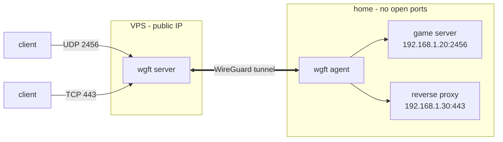
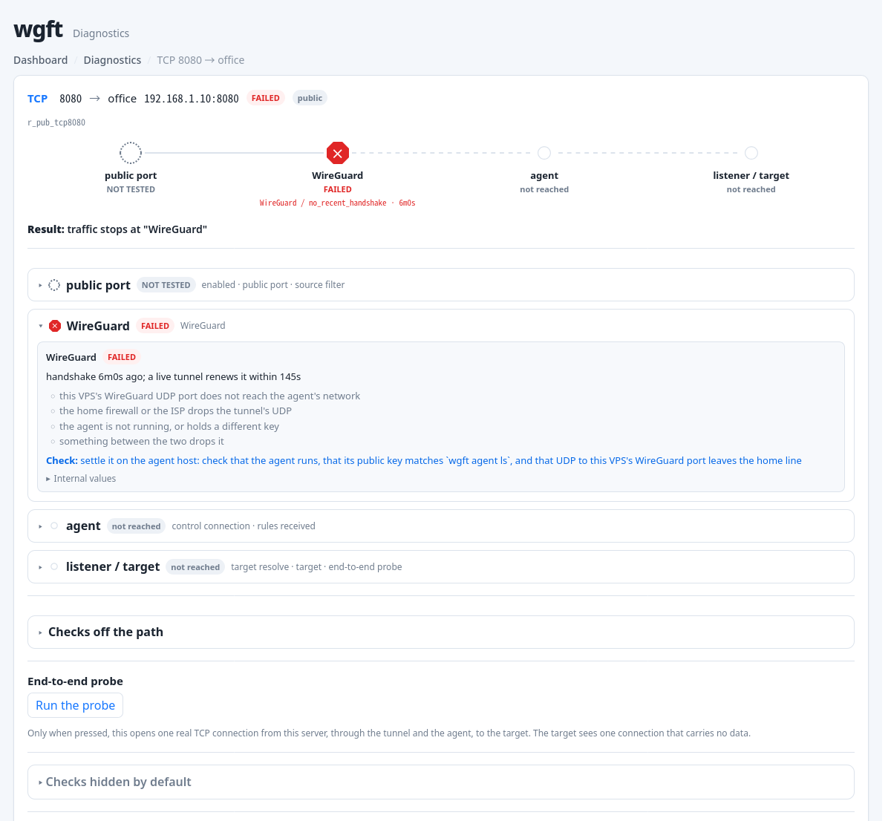

# wgft - WireGuard Forwarding Tool

[](LICENSE)
[](.github/workflows/ci.yml)
[](#status)

English | [日本語](README.ja.md)

wgft forwards TCP and UDP traffic from a VPS to services on your home network over WireGuard. The home agent connects outward to the VPS, so you do not need to open ports on the home router and it works behind CGNAT or double NAT.



wgft is aimed at workloads where arbitrary TCP/UDP forwarding matters, especially game servers. HTTPS also works, but wgft does not terminate TLS or provide authentication; those stay with your reverse proxy at home.

## Features

- One binary contains the VPS server, home agent, and CLI
- Kernel mode uses the kernel's WireGuard and nftables DNAT path, so forwarding survives a wgft process restart
- Userspace mode works without root and can run entirely in a container
- TCP and UDP port/range forwarding
- Per-rule allow/deny lists and rate limits
- Rule changes do not disconnect unrelated sessions
- Optional PROXY protocol v2 for preserving the real client IP on TCP rules
- Web dashboard for agents, rules, warnings, and forwarding state
- Diagnostics that show how far a rule's traffic gets and where it stops, from the CLI and the Web UI
- `wgft server teardown` removes only state created by wgft

## Why wgft?

wgft was inspired by Pangolin. Pangolin showed how useful the VPS-to-home tunnel model can be, but for game servers and other raw TCP/UDP services I wanted a smaller tool focused on port forwarding. It is also intended for connections such as Japanese IPv4-over-IPv6 services, where arbitrary inbound IPv4 ports may not be available.

wgft therefore stays deliberately narrow: WireGuard for the tunnel, nftables for kernel forwarding, and simple TCP/UDP rules. wgft manages the WireGuard and wgft-owned nftables state, so you do not have to hand-write the tunnel or DNAT rules. It does not provide TLS termination, SSO, certificate management, or application publishing; those are left to a reverse proxy or other software.

## Modes

| | Kernel mode `kernel` | Userspace mode `userspace` |
|---|---|---|
| Root on the VPS | Required | Not required |
| Kernel and nftables | Kernel 6.1+, nftables 1.0.6+ | None |
| Forwarding path | Kernel WireGuard + nftables DNAT | wireguard-go + userspace netstack |
| If the wgft process stops or crashes | Configured forwarding continues | Forwarding stops |
| Rate-limit evaluation | Kernel | wgft process |

In kernel mode, forwarding stays in the kernel if the wgft process crashes or restarts after startup. A VPS reboot clears that runtime state, so wgft must start again to restore forwarding. Keep the provided systemd service enabled for normal operation so reboot recovery happens automatically.

Use kernel mode when you have root on the VPS. Use userspace mode when root or kernel WireGuard is unavailable, or when you want to run the server in a container.

The VPS side runs on Linux. The home agent also runs on Windows amd64, verified on Windows 11, and on macOS on Apple silicon, verified on macOS 27. Intel Macs are not supported. wgft is IPv4-only. The home agent does not need root or a TUN device, and no administrator rights on Windows. On macOS it runs with your user's rights.

## Quick start

This is the shortest path for the common setup: kernel mode on a Linux VPS and a plain binary agent at home. For userspace mode, Docker, systemd details, firewall notes, HTTPS, logs, and teardown, see the [setup guide](docs/setup.md).

### 1. Install wgft

On Linux, download the release binary. Minimal images, such as some VPS templates and Proxmox LXC templates, do not include `curl`; install it first, for example `sudo apt install curl`.

```sh
curl -LO https://github.com/rahanahu/wgft/releases/latest/download/wgft-linux-amd64
chmod +x wgft-linux-amd64
```

Use `arm64` instead of `amd64` on Linux arm64 systems. Windows and macOS installation is covered in step 3 below.

### 2. Start the VPS server

```sh
sudo install -m 0755 wgft-linux-amd64 /usr/local/bin/wgft
sudo mkdir -p /etc/wgft
printf 'WGFT_MODE=kernel\nWGFT_WG_ENDPOINT=vps.example.com:51820\n' | sudo tee /etc/wgft/server.env
sudo chmod 0644 /etc/wgft/server.env
sudo wgft server check
sudo wgft server run
```

`server.env` is intentionally readable by all users: it contains no secrets, and the provided systemd service runs as a dynamic unprivileged user.

Open UDP 51820 and TCP 8443 on the VPS firewall. `wgft server check` also prints any forwarding exceptions required by an existing firewall, and warns if the host's own input firewall would block wgft's own ports or a rule's listen port.

Kernel mode requires IPv4 forwarding. wgft sets `net.ipv4.ip_forward=1` when needed; `wgft server teardown` reports how to revert it.

In another VPS shell, create a one-time join string:

```sh
sudo wgft agent join-string --name home
```

### 3. Start the home agent

```sh
mkdir -p ~/.local/bin ~/.wgft
mv wgft-linux-amd64 ~/.local/bin/wgft
WGFT_JOIN='<join string>' ~/.local/bin/wgft agent run --data-dir ~/.wgft
```

The credentials are stored in `~/.wgft/agent.json`; the join string is needed only for the first registration.

On Windows, download `wgft-windows-amd64.exe` from the [Releases page](https://github.com/rahanahu/wgft/releases). Open PowerShell in the folder it was saved to, for example Downloads, and run:

```powershell
Rename-Item wgft-windows-amd64.exe wgft.exe
$env:WGFT_JOIN = '<join string>'
.\wgft.exe agent run
```

The join string contains `#`, so it needs single quotes.

Later starts need only `.\wgft.exe agent run`; the saved credentials are reused. Windows Defender Firewall may prompt to allow `wgft.exe` on the first start. The tunnel keeps working whether you allow or cancel that prompt, because the agent only makes outbound connections. Stop the agent with Ctrl+C or by closing the window. Credentials are stored in `%ProgramData%\wgft\agent.json` and no administrator rights are needed. wgft installs no Windows service, so keeping the agent running across logons is up to you. A shortcut in the Startup folder is one untested option. See the [setup guide](docs/setup.md#run-the-agent-on-windows) for details.

On macOS, download the binary with `curl` in Terminal, install it, and register once:

```sh
curl -LO https://github.com/rahanahu/wgft/releases/latest/download/wgft-darwin-arm64
sudo mkdir -p /usr/local/bin
sudo install -m 0755 wgft-darwin-arm64 /usr/local/bin/wgft
WGFT_JOIN='<join string>' /usr/local/bin/wgft agent run
```

Use `curl` rather than a web browser. A browser marks the download as quarantined, and Gatekeeper blocks a binary that carries that mark and is not notarized by Apple, which is the case for wgft. `/usr/local/bin` may not exist on Apple silicon Macs, which is why the `mkdir` is there. Credentials are stored in `~/Library/Application Support/wgft/agent.json`.

To keep the agent running, stop it with Ctrl+C after it prints `registered as agent`, and install it as a LaunchDaemon with [deploy/io.github.rahanahu.wgft.agent.plist](deploy/io.github.rahanahu.wgft.agent.plist). The daemon runs with your user's rights and uses the same credentials. Do not use a LaunchAgent: started that way, the agent could not reach other hosts on the LAN, most likely because of macOS Local Network privacy. On a Mac with FileVault on, the daemon starts only after the first login following a reboot. See the [setup guide](docs/setup.md#run-the-agent-on-macos) for the steps.

### 4. Add a rule

Back on the VPS:

```sh
sudo wgft agent ls
sudo wgft rule add --agent home --udp 2456-2457 --to 192.168.1.20:2456 --group game
```

For a port range, `--to` specifies the first destination port. This example maps VPS UDP 2456 to `192.168.1.20:2456` and UDP 2457 to `192.168.1.20:2457`.

Open the forwarded port on the VPS firewall. Once the rule is active, traffic arriving at the VPS is sent through the WireGuard tunnel to the home target.

## Web UI


The dashboard shows agent connectivity, rules, drop counters, warnings, and the active nftables state. Next to each rule's state, a diagnosis mark shows where the rule's traffic stops and opens that rule's diagnostics page. The error counts in the header and the group headings count these marks. The dashboard can also issue join strings and manage ordinary rule operations.

The admin API is not exposed publicly by default; it listens on `/run/wgft/admin.sock`. Reach it through SSH:

```sh
ssh -L 8686:/run/wgft/admin.sock root@vps
```

Then open `http://localhost:8686`. Other admin access options are documented in the [setup guide](docs/setup.md#web-ui).

## Diagnosing a rule that carries no traffic

`wgft server doctor` on the VPS answers how far a rule's traffic gets, where it stops, and what to check next. Without an argument it surveys the server, the agents, and every rule. Given a rule ID, it follows that one rule from the public port to the target. It reads only what the running server has already observed and opens no connection unless you add `--probe`, which dials one real TCP connection through the tunnel and the agent to the target.

```sh
sudo wgft server doctor
sudo wgft server doctor <rule ID>
```

The Diagnostics page of the Web UI shows the same verdicts, built from the same evidence. Each rule is drawn as a path through the nodes `public port`, `WireGuard`, `agent`, and `listener / target`, marked at the node where traffic stops. The probe runs only when you press its button on a single rule's page. The screenshot below shows a rule whose traffic stops at WireGuard because its agent has not completed a recent handshake. The page also has [a list of every rule](docs/images/doctor.png).



`wgft agent doctor` runs on the agent host and answers whether an agent runs there, whether it holds credentials, and whether the host can resolve the names it needs. Run it as the user the agent runs as. It answers for the permissions of the user who runs it. Run as root, it cannot tell whether the agent's own user can reach its files, and reports the privileges item as UNKNOWN. Where the agent itself runs as root, running the command as root is correct and that UNKNOWN is expected. With `--json`, both doctor commands print a diagnostic model. Its check ids and reason codes may gain new values in later versions, but an existing value never changes its meaning.

See the [CLI reference](docs/cli.md) for what each state means and for the exit codes, and the [design](docs/design.md) for how the checks are judged.

## Documentation

- [Setup guide](docs/setup.md) - kernel/userspace modes, rootless operation, Docker, systemd, HTTPS, Web UI access, logs, and teardown
- [CLI reference](docs/cli.md) - generated command reference with examples
- [Design](docs/design.md) - protocol, security, forwarding behavior, and design decisions
- [Architecture](docs/architecture.md) - package layout and code paths
- [CLAUDE.md](CLAUDE.md) - project development conventions and test setup

`wgft <command> --help` also includes examples for every command.

## Status

v1.1.2. The compatibility contract has been in effect since v1.0; the version number is not a level of maturity. It covers the Linux server and the Linux agent only; the Windows and macOS agents are provisional and outside it. Kernel mode has been verified on the author's VPS/home setup for UDP and TCP forwarding, NAT traversal, reconnects, reboot recovery, and teardown. Userspace mode has been verified in the development lab and on a VPS. `wgft server doctor` and `wgft status` have been verified in kernel mode against a running server and one registered agent, across a healthy deployment, an agent refusing a target, and an agent whose control connection is down. Recovery from a rule set that fails to apply every time has been verified in the development lab: the server holds the rest of its startup with the admin API listening, so the rules can be made smaller without erasing the data directory. `wgft agent doctor`, including its `--json` output, and the Web UI diagnostics page have been verified against a server in kernel mode on a staging VPS and an agent in an LXC container running as its own system user, across a healthy deployment, a stopped agent, a target that refuses connections, and a target that silently drops them. Provisional status does not itself withdraw the currently published Windows or macOS agent binaries. General agent behavior, such as registration, tunneling, and recovery after a restart, has been verified on real Windows and macOS hardware. The connection-liveness check that now decides when the agent reconnects is a newer mechanism and has not been verified on real hardware on either platform, which is the main reason Windows and macOS stay outside the contract for now. Relayed flows are bounded per rule, source, and process to limit memory use under load. The upgrade path is supported, but reverting to an older version afterward is not promised. Back up the data directory before upgrading so you can restore it if you need to move back. From v1.1.1 on, the server database uses schema version 8. v1.1.0 and earlier refuse to open it, so moving back to v1.1.0 or earlier needs a backup taken before the upgrade to v1.1.1 or later. See the design and setup documentation for implementation and deployment details.

## Security

The provided server systemd unit runs wgft as an unprivileged user with only the capabilities needed for forwarding. The public surface is WireGuard, the agent API, and ports you explicitly forward; the admin API is local-only by default.

The agent connects to whatever target the server sends it, so `WGFT_AGENT_ALLOW_TARGETS` on the agent host restricts that to the LAN addresses you list, keeping a compromised server out of the rest of the LAN.

To report a vulnerability, see [SECURITY.md](SECURITY.md).

## License

[MIT](LICENSE). Third-party module licenses are collected in `THIRD_PARTY_LICENSES.txt` and included with releases and container images.
