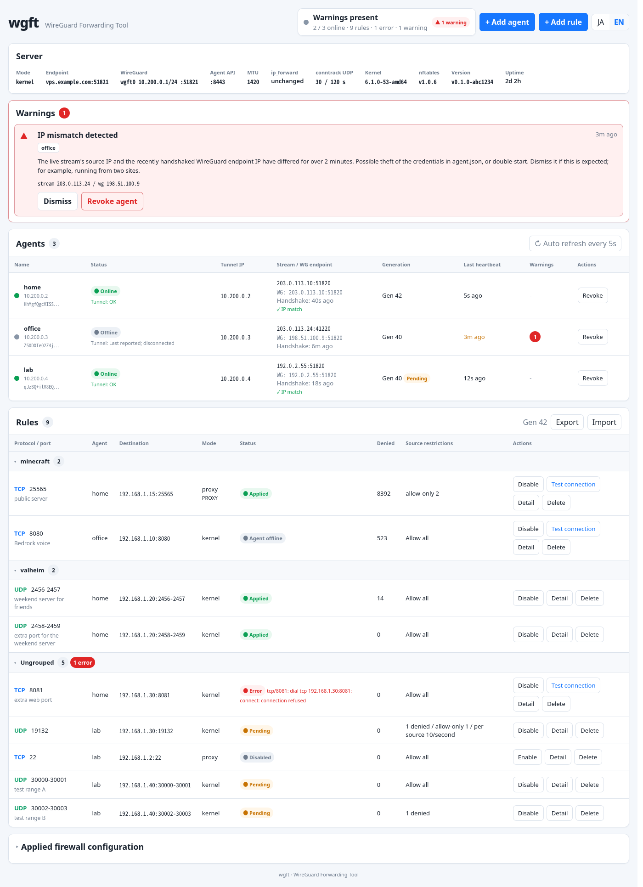

# wgft - WireGuard Forwarding Tool

[](LICENSE)
[](.github/workflows/ci.yml)
[](#status)

English | [日本語](README.ja.md)

wgft forwards traffic that arrives at a VPS to services on your home network through a WireGuard tunnel. The agent at home dials out to the VPS, so you never open a port on your router, and it works behind CGNAT or double NAT.

The VPS only rewrites the destination address and passes packets on unchanged. A UDP game server and an HTTPS site are the same one-line rule, and TLS certificates and authentication stay with the reverse proxy at home.


## Intended use

wgft is built for workloads where UDP has to just work: game servers, voice chat, and the like. If a game server is all you forward, the agent is the only thing you run at home.

For HTTPS, TLS termination and certificates are the job of the reverse proxy at home. wgft forwards port 443 untouched and has no certificate or authentication features of its own. See "How it compares" for how it differs from Pangolin and Cloudflare Tunnel.

## How it compares

wgft, [Pangolin](https://github.com/fosrl/pangolin), and Cloudflare Tunnel all expose a home service through a VPS or an external network. Pangolin is an integrated, self-hosted reverse proxy. It handles certificate issuance, identity-aware access control including SSO, PIN- or passcode-protected links for sharing a resource, and a web dashboard. Cloudflare Tunnel runs a connector at home and connects it to Cloudflare's network, centered on publishing HTTPS applications.

Where wgft is stronger:
- Light footprint: the VPS side is one static binary and a systemd unit. No Docker, no Traefik, and resident memory in the low tens of MB
- Kernel-path forwarding: nftables DNAT and the kernel's own WireGuard do the work, so UDP games and any TCP pass through unchanged, and a restart of the wgft process leaves existing flows running
- Leaves the rest alone: wgft never touches other WireGuard interfaces or nftables tables, and `wgft server teardown` restores the VPS
- Minimal setup: one env file with a mode and an endpoint, plus rules. No domain or certificate required

Where wgft is weaker:
- No HTTPS of its own: certificates, SSO, shareable links, and browser-based auth are left to a reverse proxy at home
- Narrow admin access: the dashboard is reachable only through a root Unix socket, SSH port forwarding, or Tailscale, and there is no multi-user model
- Flat management: there is no site or user management, only agents and rules

Pick Pangolin when you want to expose web services with authentication and certificates managed for you. Pick wgft when you want to expose a game server or arbitrary ports with the smallest possible moving parts.

## What you get

- Kernel-path forwarding: nftables DNAT sends packets straight into the tunnel, with no relay process on the VPS. wgft owns exactly one nftables table and leaves yours alone
- Per-rule source control: deny lists, allow lists, and rate limits (new flows, packets, per source). A deny cuts flows already in progress
- Rule changes without disconnects: adding, removing, or resizing a rule leaves unrelated sessions running
- Real client IPs at home: a TCP rule in proxy mode adds a PROXY protocol v2 header, which any reverse proxy that speaks it can read
- Stolen-credential warnings: if the home credentials (`agent.json`) are used from a second place, the dashboard flags it as a source IP mismatch or flapping
- Clean uninstall: `wgft server teardown` deletes only what wgft created and prints whatever is left for you to revert by hand

## Web UI



One page covers everything: every agent's connection, each rule's status and drop count, warnings, and the nftables table currently in effect. You can add agents and rules and test a TCP rule end to end from the same page. It is available in English and Japanese.

There is no login. The admin API does not listen on any TCP port of the VPS; it listens only on the Unix socket `/run/wgft/admin.sock`, which only root can open. From your browser, reach it by forwarding a local port to that socket over SSH. The target of `ssh -L` can be a socket path, not just a port. The socket is owned by root, so log in as root.

```sh
ssh -L 8686:/run/wgft/admin.sock root@vps
```

Browse to `http://localhost:8686` while the session is open. If root cannot log in over SSH, set `WGFT_ADMIN=127.0.0.1:8686` in `server.env`. The API then listens on TCP 8686 on the loopback address of the VPS instead of the socket, and `ssh -L 8686:127.0.0.1:8686 vps` forwards to it. With that setting every local user on the VPS can reach the admin API. If the VPS is on a Tailscale network, set `WGFT_ADMIN_TAILSCALE=true` and open `http://<Tailscale IP of the VPS>:8686` from any device on the tailnet. When the `tailscale` CLI is present on the VPS, the MagicDNS name is picked up automatically and accepted as a Host too. `WGFT_ADMIN_HOST` adds further names.

## Requirements

Both sides run on Linux. The server additionally needs kernel 6.1 or newer, nftables 1.0.6 or newer (Debian 12, Ubuntu 24.04, or later), and root. WireGuard itself does not have to be installed: the kernel module ships with those kernels, and the server drives it directly without `wg` or `wg-quick`. On a VPS whose kernel lacks the module, the server stops with a message saying so, and the userspace mode described below is the way to run it. The agent needs nothing else: no root, no TUN device.

IPv4 only. If you want to reach the VPS by name, point a domain at it.

## Setup

**1. Get the binary**

A single binary is the server, the agent, and the CLI. Download it from the [releases page](https://github.com/rahanahu/wgft/releases) on both the VPS and the home machine. On arm64, replace `amd64` with `arm64`.

```sh
curl -LO https://github.com/rahanahu/wgft/releases/latest/download/wgft-linux-amd64
curl -LO https://github.com/rahanahu/wgft/releases/latest/download/wgft-linux-amd64.sha256
sha256sum -c wgft-linux-amd64.sha256
```

With Go 1.26 or newer, `go install github.com/rahanahu/wgft/cmd/wgft@latest` works too.

**2. Set up the server on the VPS**

wgft is configured through `WGFT_*` environment variables, and `/etc/wgft/server.env` is read at startup. [deploy/server.env.example](deploy/server.env.example) lists every key and marks the required ones. The forwarding mode and the address agents connect to are enough to get started.

```sh
sudo install -m 0755 wgft-linux-amd64 /usr/local/bin/wgft
sudo mkdir -p /etc/wgft
printf 'WGFT_MODE=kernel\nWGFT_WG_ENDPOINT=vps.example.com:51820\n' | sudo tee /etc/wgft/server.env
sudo chmod 0600 /etc/wgft/server.env
```

Check the environment before the first start.

```sh
sudo wgft server check
```

`check` reports three things:

- the effective settings (mode, interface, WireGuard port, address range) and whether they match what a previous start recorded
- a leftover WireGuard interface that holds the same server key under another name, which happens after changing `WGFT_WG_INTERFACE`
- lines your existing firewall needs. If the forward chain is `policy drop` (the default when ufw or Docker is installed), it prints the lines that let wgft's forwarding through. They are port-independent, so you add them once and never again

wgft never edits your firewall. Add the printed lines yourself. The only kernel setting wgft writes is `net.ipv4.ip_forward=1`, which DNAT forwarding needs; `wgft server teardown` tells you how to revert it.

Then open UDP 51820 (WireGuard) and TCP 8443 (agent API). With ufw:

```sh
sudo ufw allow 51820/udp
sudo ufw allow 8443/tcp
```

With firewalld, `firewall-cmd --permanent --add-port=51820/udp --add-port=8443/tcp` does the same.

To run wgft as a service, the unit in [deploy/server.service](deploy/server.service) works as is:

```sh
sudo install -m 0644 deploy/server.service /etc/systemd/system/wgft.service
sudo systemctl daemon-reload
sudo systemctl enable --now wgft
```

To try it without a service, `sudo wgft server run` starts it in place.

Finally, issue a join string for the home agent:

```sh
sudo wgft agent join-string --name home
```

This prints a single line like the one below. It can be used once, expires after an hour, and is pasted verbatim in step 3. If it expires, run the command again.

```text
wgft://vps.example.com:8443/k3Jt8vQwN2mXbL7cR9aZpQ#sha256:3f1c9a0b7d2e4c8a1f6b5e9d0c3a7b2e8d4f1a6c5b9e0d3f7a2c8b1e6d4f9a02
```

*Docker*

The server can also run as a container in the userspace mode, instead of the systemd unit above. It needs no root, no kernel WireGuard, and no nftables. `vpsd` holds the tunnel in wireguard-go and a netstack inside its own process, the same design the agent already uses. See docs/design.md section 6.3 for the full comparison with kernel mode; the short version is that stopping the container stops forwarding, where kernel mode leaves wg0 and the nftables table running through a restart. TCP is terminated inside the wgft process rather than passed through unchanged. Flood resistance is that of any userspace proxy. `packet_rate` limits UDP datagrams only, not TCP.

Clone the repository for the compose file, edit `WGFT_WG_ENDPOINT` in [deploy/server.compose.yaml](deploy/server.compose.yaml), and bring it up. The compose file publishes ports with `ports:`, and every forwarded port has to be listed there. `network_mode: host` publishes everything without editing the list, but ports below 1024 are then out of reach, because the container keeps the host's restriction on them. With the `ports:` list, 443 works. Both were checked with the image built locally.

```sh
git clone https://github.com/rahanahu/wgft.git && cd wgft
# edit this line in deploy/server.compose.yaml
#   WGFT_WG_ENDPOINT: "REPLACE_WITH_vps.example.com:51820"  -> this VPS's address and WireGuard port
docker compose -f deploy/server.compose.yaml up -d
```

The CLI runs inside the container, where it reads the same `WGFT_ADMIN` as the server and reaches the admin socket in the state volume directly. From here on, `docker compose exec` replaces `sudo` in front of every command, including the join string above.

```sh
docker compose -f deploy/server.compose.yaml exec wgft-server wgft agent join-string --name home
```

This path was verified with the image built locally with Podman; the published image at `ghcr.io/rahanahu/wgft-server` appears with the next release.

**3. Set up the agent at home**

Run the agent either as a plain binary or in Docker. Pick one. Neither needs root.

*Plain binary*

Put the binary from step 1 on your PATH (the commands below use `~/.local/bin`; add it to PATH if it is not there yet) and start it with the join string from step 2. Paste it exactly as printed, starting with `wgft://`, and quote it because it contains a `#`. `--data-dir` is where the credentials (keys and registration details) go.

```sh
chmod +x wgft-linux-amd64 && mkdir -p ~/.local/bin ~/.wgft && mv wgft-linux-amd64 ~/.local/bin/wgft
WGFT_JOIN='<join string from step 2>' wgft agent run --data-dir ~/.wgft
```

The first start registers the agent and writes `~/.wgft/agent.json`. After that, `wgft agent run --data-dir ~/.wgft` is all you need. The join string is not used again.

To run the agent as a service, use the unit in [deploy/agent.service](deploy/agent.service). It runs as the unprivileged user `wgft`, expects the binary at `/usr/local/bin/wgft`, and reads `/etc/wgft/agent.env`, which only needs the join string.

```sh
sudo install -m 0755 ~/.local/bin/wgft /usr/local/bin/wgft
sudo useradd --system --home-dir /var/lib/wgft --shell /usr/sbin/nologin wgft
sudo mkdir -p /etc/wgft
printf 'WGFT_JOIN=<join string from step 2>\n' | sudo tee /etc/wgft/agent.env >/dev/null
sudo chown root:wgft /etc/wgft/agent.env && sudo chmod 0640 /etc/wgft/agent.env
sudo install -m 0644 deploy/agent.service /etc/systemd/system/wgft-agent.service
sudo systemctl daemon-reload && sudo systemctl enable --now wgft-agent
```

The credentials then live in `/var/lib/wgft/agent.json`.

*Docker*

No binary needed. The agent image is published as `ghcr.io/rahanahu/wgft-agent` for amd64 and arm64. Clone the repository for the compose file, edit one line in [deploy/agent.compose.yaml](deploy/agent.compose.yaml), and bring it up. To build the image from source instead, uncomment the `build:` lines in the compose file and add `--build`. If the container cannot reach your LAN targets, uncomment `network_mode: host` in the compose file.

```sh
git clone https://github.com/rahanahu/wgft.git && cd wgft
# edit this line in deploy/agent.compose.yaml
#   WGFT_JOIN: "REPLACE_WITH_JOIN_STRING"  -> the join string from step 2, exactly as printed
# WGFT_NAME is not needed: the agent name comes from the join string. Delete the line or leave it empty.
docker compose -f deploy/agent.compose.yaml up -d
```

**4. Add forwarding rules**

Back on the VPS, confirm the agent registered:

```sh
sudo wgft agent ls
```

In the `home` row, STREAM should show the agent's IP, TUNNEL should say `ok`, and HANDSHAKE should show an age. RULES is empty for now.

```text
NAME  ADDRESS     STREAM              HEARTBEAT  GEN  TUNNEL  WG_ENDPOINT         HANDSHAKE  RULES  WARN
home  10.200.0.2  203.0.113.10:39222  4s ago     1    ok      203.0.113.10:51820  12s ago
```

Now add rules:

```sh
# game server: UDP 2456-2457 on the VPS -> 192.168.1.20:2456 at home
sudo wgft rule add --agent home --udp 2456-2457 --to 192.168.1.20:2456 --group game

# HTTPS: TCP 443 on the VPS -> the reverse proxy at home, with the client IP via PROXY protocol
sudo wgft rule add --agent home --tcp 443 --to 192.168.1.30:443 --proxy --proxy-protocol
```

For a port range, `--to` names the first port and the rest follow in order, so 2457 reaches 192.168.1.20:2457 in this example. Open the forwarded ports in the firewall (UDP 2456-2457 and TCP 443 here). Once `sudo wgft agent ls` shows `ok` in the RULES column, you are done. Rules reach the agent within seconds, and adding or removing one never drops sessions in progress. When someone abuses a port, `sudo wgft rule deny add <rule id> 203.0.113.0/24` blocks them, including flows already open. A unique prefix of the rule ID, as `rule ls` prints it, is enough.

**Publishing HTTPS**

TLS termination and certificates are handled by the reverse proxy at home; wgft only forwards ports 443 and 80. The setup with Caddy was verified in the lab (`lab/caddy/` has the configuration and the record).

Caddy 2.11 or newer is required. The Debian 12 apt package (2.6.2) lacks the PROXY protocol listener wrapper, so install Caddy from its official apt repository. Run Caddy on the same host as the agent and add two rules: port 443 in proxy mode with PROXY protocol so the client IP gets through, and port 80 passed through as is.

```sh
sudo wgft rule add --agent home --tcp 443 --to 192.168.1.30:443 --proxy --proxy-protocol
sudo wgft rule add --agent home --tcp 80  --to 192.168.1.30:80
```

In the Caddyfile, apply `proxy_protocol` to the 443 listener only, and put the address of the host running the agent in `allow`. The TCP peer Caddy sees is the agent (the last hop of the relay), not the VPS's WireGuard address.

```
{
	servers 192.168.1.30:443 {
		listener_wrappers {
			proxy_protocol {
				allow 192.168.1.30/32
			}
			tls
		}
	}
}

example.com {
	reverse_proxy 192.168.1.40:8080
}
```

With this, `client_ip` in Caddy's access log is the real client address, and Caddy's default HTTP to HTTPS redirect works (verified in the lab). Certificate issuance by Let's Encrypt should work because port 80 on the VPS reaches Caddy, but it cannot be tested in the lab and is unverified; follow Caddy's own documentation.

**5. Uninstalling**

Teardown removes only what wgft created. It does not touch other tables or firewall ports, and it prints a list of anything you need to revert by hand.

```sh
sudo systemctl disable --now wgft
sudo wgft server teardown --dry-run      # show what would be removed and what to revert by hand
sudo wgft server teardown --purge --yes  # do it; --purge also deletes keys and certificates
```

Without `--purge`, keys and certificates stay, so restarting the server brings it back with the same identity and agents simply reconnect. After a `--purge`, a restarted server has new keys and a new certificate, so registered agents cannot reconnect and keep retrying against the certificate mismatch. Issue a fresh join string, set it in `WGFT_JOIN` and restart the agent. The agent detects the changed certificate and registers again, keeping its credentials file `agent.json` and its WireGuard key. Rules were deleted on the server side, so add them again. To remove the home side entirely, `docker compose -f deploy/agent.compose.yaml down -v` removes the agent along with its credentials.

## Status

Alpha, v0.1.1. Verified on the author's own VPS and home network: UDP and TCP reachable from outside, registration through NAT, recovery by re-registration, automatic recovery after a VPS reboot, and teardown. The reboot cost under 30 seconds of downtime. Not yet verified: links with a small MTU, and the Web UI over a real Tailscale network. v0.2.0 is planned to add a user-space mode that runs the VPS side without root.

## Documentation

- [docs/design.md](docs/design.md) - the design document, with every decision and its reasoning
- [docs/architecture.md](docs/architecture.md) - the package layout and the path one operation takes through it
- [CLAUDE.md](CLAUDE.md) - project conventions: the developer lab, how tests are organized, the CI checks, and how documents are written

## Security

Installing the server needs root on the VPS, but under the provided systemd unit the process itself runs as an unprivileged user that systemd allocates, holding only `CAP_NET_ADMIN` and `CAP_NET_BIND_SERVICE`. Only three things face the public IP: WireGuard, the agent API, and the forwarded ports. The admin API is never exposed. To report a vulnerability, see [SECURITY.md](SECURITY.md).

## License

[MIT](LICENSE). The licenses of the Go modules compiled into the binary are collected in `THIRD_PARTY_LICENSES.txt`, attached to each release and included in the container image under `/usr/share/doc/wgft/`.
