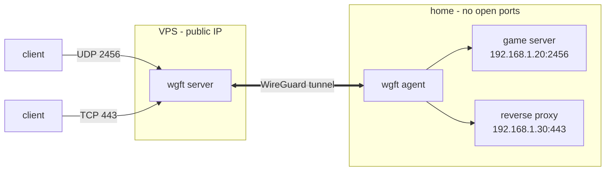
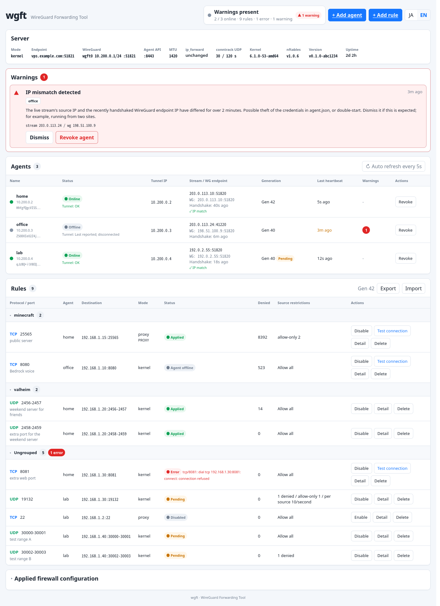

# wgft - WireGuard Forwarding Tool

[](LICENSE)
[](.github/workflows/ci.yml)

English | [日本語](README.ja.md)

wgft forwards TCP and UDP traffic from a VPS to services on your home network over WireGuard. The home agent connects outward to the VPS, so you do not need to open ports on the home router and it works behind CGNAT or double NAT.


```mermaid
flowchart LR
  c1[client] -->|UDP 2456| s
  c2[client] -->|TCP 443| s
  subgraph vps[VPS - public IP]
    s[wgft server]
  end
  s <==>|WireGuard tunnel| a
  subgraph home[home - no open ports]
    a[wgft agent] --> g[game server<br>192.168.1.20:2456]
    a --> p[reverse proxy<br>192.168.1.30:443]
  end
```

wgft is for forwarding arbitrary TCP and UDP ports, especially to game servers. It can forward HTTPS, but TLS termination and authentication belong on your reverse proxy at home.

## Features

- One binary contains the VPS server, home agent, and CLI
- Forwards a VPS port to a TCP or UDP service at home, including port ranges
- Applies per-rule source allow/deny lists and rate limits
- Changes rules without disconnecting unrelated sessions
- Passes the real client IP to a TCP target with optional PROXY protocol v2
- Shows agents, rules, and where traffic stops in the Web UI and CLI

## Why wgft?

wgft was inspired by Pangolin. Pangolin showed how useful the VPS-to-home tunnel model can be, but for game servers and other raw TCP/UDP services I wanted a smaller tool focused on port forwarding. This also fits connections, such as some Japanese IPv4-over-IPv6 services, where the home router cannot expose arbitrary IPv4 ports.

wgft keeps to a WireGuard tunnel, kernel forwarding through nftables, and straightforward TCP/UDP rules. It manages its WireGuard and nftables state, so you do not have to build the tunnel and DNAT rules by hand. It leaves TLS termination, SSO, certificates, and web app publishing to other software.

## Requirements and modes

The server runs on Linux. The agent runs on Linux, Windows amd64, and Apple silicon macOS; Intel Macs are not supported. Forwarding is IPv4-only. The server and Linux agent each support two modes:

| | Kernel mode `kernel` | Userspace mode `userspace` |
|---|---|---|
| Forwarding path | Linux WireGuard and nftables | wireguard-go and userspace netstack |
| Privileges | Requires `CAP_NET_ADMIN` | Normally needs neither root nor a TUN device |
| If the wgft process stops | Configured forwarding continues | Forwarding stops |

Use kernel mode on a VPS where you have root. Userspace mode is available without root or kernel WireGuard and can run in a container. Kernel mode requires Linux 6.1+ and nftables 1.0.6+. The agent defaults to userspace mode. The [kernel-mode agent guide](docs/agent-kernel.md) covers the requirements for a Linux agent in kernel mode.

Linux userspace mode may need higher host socket buffer limits. With the default flow limits, a server with one agent and one forwarded TCP port needs about 5.9 GiB of host memory. That figure is the documented worst-case estimate: the flow state, buffers and other holdings counted in the design's calculation, each filled to its limit at once by an attack. It is not an estimate of normal use. Lower flow limits cannot bring that requirement below about 2.9 GiB. See [userspace mode on the VPS](docs/setup-server-userspace.md) for the requirement and the [design](docs/design.md#7a-内部アーキテクチャ) for the calculation.

## Quick start

This example uses kernel mode on a Linux VPS and a Linux home agent. Choose from [deployment options](docs/setup-alternatives.md) for [Windows](docs/setup-desktop.md#run-the-agent-on-windows), [macOS](docs/setup-desktop.md#run-the-agent-on-macos), Docker, and other environments. The [setup guide](docs/setup.md) covers Linux systemd.

### 1. Download wgft

Run this on both the VPS and the home Linux machine. Install `curl` first if your image does not include it.

```sh
curl -LO https://github.com/rahanahu/wgft/releases/latest/download/wgft-linux-amd64
chmod +x wgft-linux-amd64
```

On Linux arm64, use `arm64` instead of `amd64` in the filename.

### 2. Start the VPS server

```sh
sudo install -m 0755 wgft-linux-amd64 /usr/local/bin/wgft
sudo mkdir -p /etc/wgft
printf 'WGFT_MODE=kernel\nWGFT_WG_ENDPOINT=vps.example.com:51820\n' | sudo tee /etc/wgft/server.env
sudo chmod 0644 /etc/wgft/server.env
sudo wgft server check
sudo wgft server run
```

Replace `vps.example.com` with the VPS hostname. Open UDP 51820 and TCP 8443 on the VPS firewall. `wgft server check` also reports exceptions needed by an existing firewall. Kernel mode enables IPv4 forwarding when needed. `server.env` contains no secrets and uses mode 0644 so the provided systemd unit can read it.

In another VPS shell, create a join string for the first registration:

```sh
sudo wgft agent join-string --name home
```

The [setup guide](docs/setup.md#issue-a-join-string) also shows how to issue the join string in the Web UI.

### 3. Start the home agent

```sh
mkdir -p ~/.local/bin ~/.wgft
mv wgft-linux-amd64 ~/.local/bin/wgft
WGFT_JOIN='<join string>' ~/.local/bin/wgft agent run --data-dir ~/.wgft
```

Put the issued join string inside the single quotes and treat it as a secret. Credentials are saved in `~/.wgft/agent.json`; later starts do not need the join string.

### 4. Add a forwarding rule

Back on the VPS:

```sh
sudo wgft agent ls
sudo wgft rule add --agent home --udp 2456-2457 --to 192.168.1.20:2456 --group game
```

You can add the same forwarding rule with "+ Add rule" in the Web UI.

This maps UDP 2456 and 2457 on the VPS to the same ports on `192.168.1.20` at home. Open the forwarded ports on the VPS firewall too.

## After the first forward



The Web UI shows agent and rule status, lets you add rules, and helps diagnose failed forwarding. The admin API is local-only by default. Forward it over SSH, then open `http://localhost:8686`:

```sh
ssh -L 8686:/run/wgft/admin.sock root@vps
```

If traffic does not reach its target, run `sudo wgft server doctor` on the VPS. The Web UI's [rule diagnostics page](docs/images/doctor-rule.png) also shows where traffic stops. Use [agent doctor](docs/cli.md#wgft-agent-doctor) to check the home side, or [agent disable](docs/cli.md#wgft-agent-disable) to pause forwarding for an agent.

You can restrict the LAN targets the agent will reach with [`WGFT_AGENT_ALLOW_TARGETS`](docs/operations.md#restrict-agent-targets).

## More detail

- [Setup guide](docs/setup.md): Run the Linux server and agent with systemd and add the first rule
- [Deployment options](docs/setup-alternatives.md): Windows, macOS, Docker, and VPS hosts without root
- [Operations guide](docs/operations.md): Web UI, HTTPS, logs, and teardown
- [CLI reference](docs/cli.md): commands and examples
- [Design](docs/design.md) and [architecture](docs/architecture.md): forwarding behavior and implementation
- [Development conventions](CLAUDE.md): test environment and change process
- [Security policy](SECURITY.md): vulnerability reporting

## Status

v1.4.1. The compatibility contract in effect since v1.0 covers the Linux server and agent, plus the Windows agent within the range verified on Windows 11 hardware. The macOS agent has been verified for basic operation on real hardware, but its newer reconnect liveness check has not been verified there, so it remains outside the contract. The covered behavior is defined in [design section 7a.11](docs/design.md#7a11-v10-の互換性の保証サーフェスごとの一覧).

Downgrading after an upgrade is not guaranteed. Back up the server data directory before upgrading. The server database uses schema version 9 from v1.2.0 onward; v1.1.x and earlier servers cannot open it.

## License

[MIT](LICENSE). The Go module licenses bundled in the binary are listed in `THIRD_PARTY_LICENSES.txt` and included with releases and container images.
